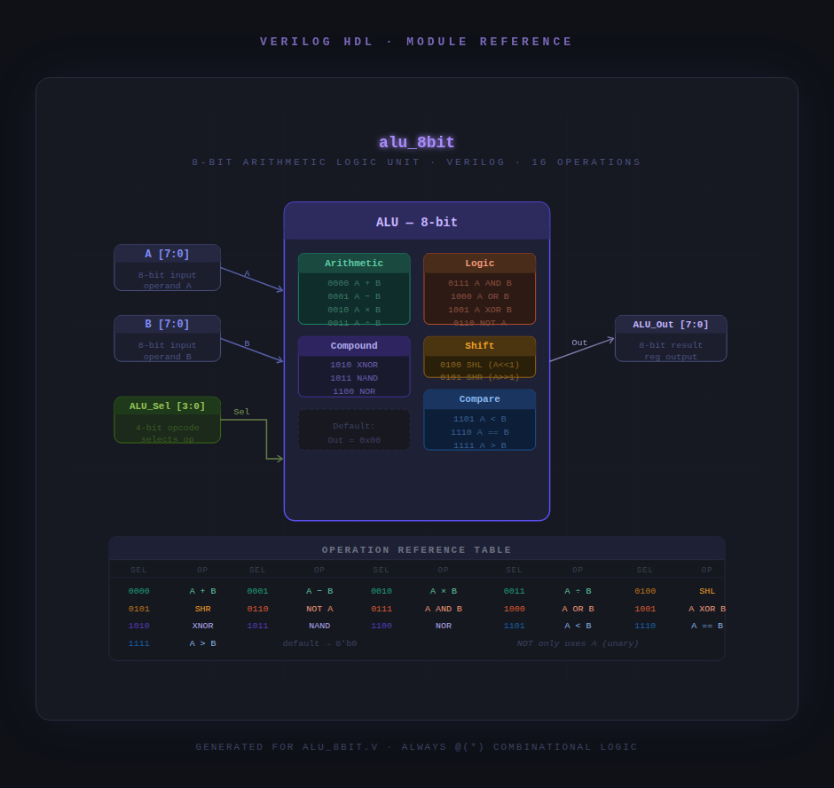

# 8-bit Arithmetic Logic Unit (ALU) IP

## 1. Description
This IP core implements an 8-bit Arithmetic Logic Unit (ALU) designed in Verilog HDL. The module is entirely combinational and performs a wide array of mathematical, logical, shifting, and comparison operations based on a 4-bit selection input (`ALU_Sel`). It is structured to serve as a foundational execution unit within a digital processor or processor-subcircuit architecture.

---

## 2. Block Diagram
The architectural block diagram below illustrates the inputs, outputs, and internal control flow of the ALU module:
