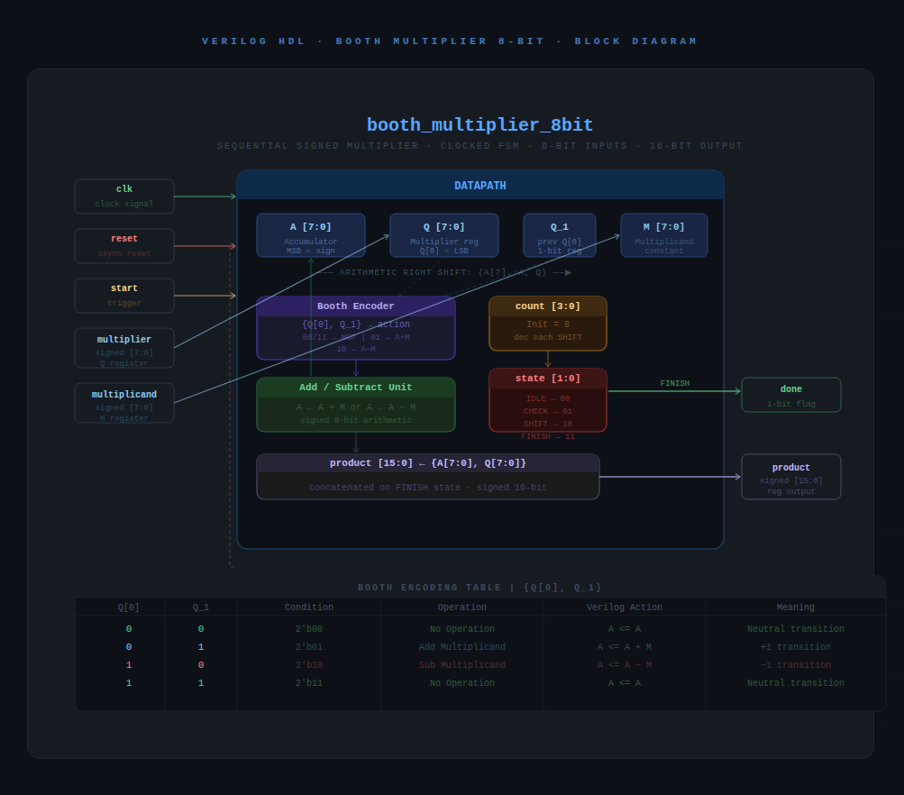

# 8-bit Sequential Signed Booth Multiplier IP

## 1. Description
This IP core implements a synchronous, sequential 8-bit signed multiplier using the **Radix-2 Booth Multiplication Algorithm**. Controlled by an internal Finite State Machine (FSM), the hardware architecture reduces the overall overhead of partial product generation and handles both positive and negative numbers natively in 2's complement representation. The module operates entirely on a clocked datapath, producing an accurate 16-bit signed product output along with a conversion completion flag (`done`).

---

## 2. Structural Block Diagram
The architectural block diagram below illustrates the modular datapath execution units, registers, control signals, and internal bit-level arithmetic structures:

---

## 3. Finite State Machine (FSM) State Chart
The execution control flow of the hardware is governed by a 4-state Mealy FSM running on the positive edge of the clock or asynchronous reset:

### FSM State Operational Breakdowns:
1. **`IDLE` (2'b00):** Waits for the external execution trigger `start`. Upon activation, initializes the Accumulator (`A`), loads operands into Multiplier (`Q`) and Multiplicand (`M`) registers, clears the previous multiplier bit (`Q_1`), presets the iteration `count` to 8, and transitions directly into the `CHECK` state.
2. **`CHECK` (2'b01):** Inspects the target operational bits `{Q[0], Q_1}` to dictate the arithmetic action (Add, Subtract, or No-Op) based on the Booth Encoding Table. Instantly routes execution to the `SHIFT` state.
3. **`SHIFT` (2'b10):** Performs a concurrent Arithmetic Right Shift (`>>>`) on the concatenated boundary `{A, Q, Q_1}` while preserving the crucial sign bit (`A[7]`). If the iteration count reaches 1, it changes state to `FINISH`; otherwise, decrements the counter and loops back to `CHECK`.
4. **`FINISH` (2'b11):** Concatenates the high-order and low-order results into the final 16-bit `product` register, pulses the `done` completion bit high, and routes back to `IDLE`.

---

## 4. Pin Description

| Pin Name       | Direction | Data Type | Width   | Description |
|:---------------|:----------|:----------|:--------|:------------|
| `clk`          | Input     | Wire      | 1 bit   | Global Master Clock signal |
| `reset`        | Input     | Wire      | 1 bit   | Asynchronous High Reset signal |
| `start`        | Input     | Wire      | 1 bit   | Operational trigger signal to initiate multiplication |
| `multiplier`   | Input     | Signed    | 8 bits  | Multiplier operand (Q register data source) |
| `multiplicand` | Input     | Signed    | 8 bits  | Multiplicand operand (M register data source) |
| `product`      | Output    | Reg       | 16 bits | Combined 16-bit signed product output array |
| `done`         | Output    | Reg       | 1 bit   | Execution complete status flag |

---

## 5. Booth Encoding Reference Table

The operations executed within the combinational `CHECK` stage follow this hardware encoding table:

| Q[0] | Q_1 | Condition Code | Verilog Hardware Action | Mathematical Meaning |
|:----:|:---:|:--------------:|:------------------------|:---------------------|
| `0`  | `0` | `2'b00`        | `A <= A;`               | Neutral Transition (No-Op) |
| `0`  | `1` | `2'b01`        | `A <= A + M;`           | End of String (+1 Transition) |
| `1`  | `0` | `2'b10`        | `A <= A - M;`           | Start of String (-1 Transition) |
| `1`  | `1` | `2'b11`        | `A <= A;`               | Inside String (No-Op) |

---

