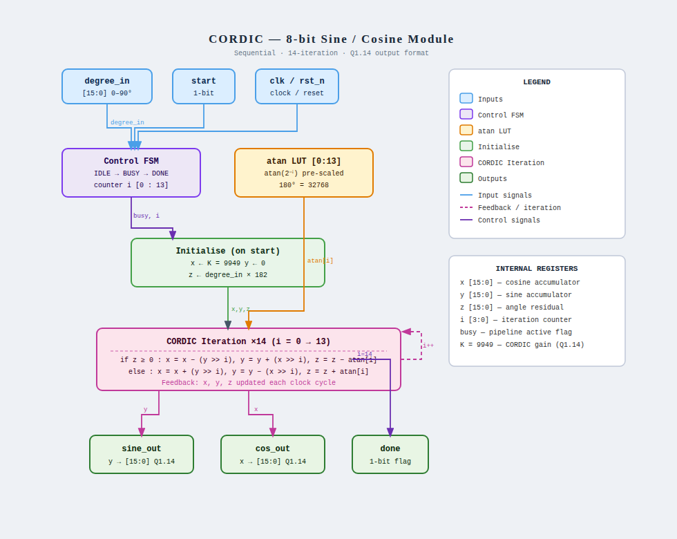

# 16-bit Sequential CORDIC (Sine/Cosine) IP Core

## 1. Description
This IP core implements a hardware-optimized **16-bit CORDIC (Coordinate Rotation Digital Computer)** processor in sequential Verilog HDL. Operating in **Rotation Mode**, the module calculates the trigonometric functions $\sin(\theta)$ and $\cos(\theta)$ concurrently given an input angle $\theta$ spanning $0^\circ$ to $90^\circ$.

Trigonometric evaluation using traditional series expansion or intensive multipliers is computationally expensive and area-heavy. This CORDIC architecture bypasses complex multipliers by reducing vector rotation to an iterative sequence of simple **binary right shifts (`>>>`) and additions/subtractions**. To optimize execution latency, the initial accumulator condition $x_0$ is pre-scaled by the global CORDIC processing gain $K$. Consequently, after $14$ clock cycles of iterative tracking, the outputs resolve directly into high-precision **Q1.14 fixed-point format** without requiring an explicit post-processing hardware multiplier.

---

## 2. Iterative Control Flow Datapath
The sequential control flow, loop transitions, and target internal register structures map exactly to the algorithmic engineering map below:

### Execution Sequence & Bit Mechanics:
1. **Angle Pre-Scaling & Conversion:** Standard degree values ($0^\circ$ to $90^\circ$) from `degree_in` are scaled to 16-bit CORDIC tracking units using the constant scaling factor `ANGLE_CONV = 182` ($32768 / 180^\circ$) to accommodate fast integer math inside the angle register $z$.
2. **Pre-Scaled Initialization:** Upon receiving a single-cycle `start` pulse, the controller enters a `busy` state. The cosine accumulator $x$ is loaded with the CORDIC system gain constant $K$ ($0.60725 \times 16384 = 9949$), the sine accumulator $y$ is cleared to 0, and the loop counter index $i$ resets to 0.
3. **The Micro-Rotation Iteration Loop ($i = 0 \rightarrow 13$):**
   * The sign bit of the angle residual register ($z \ge 0$) dictates the direction of the vector micro-rotation.
   * If $z$ is positive, the vector rotates clockwise: $x = x - (y \gg i)$, $y = y + (x \gg i)$, and the residual angle is decremented: $z = z - \text{atan\_table}[i]$.
   * If $z$ is negative, the vector rotates counter-clockwise: $x = x + (y \gg i)$, $y = y - (x \gg i)$, and the residual angle is incremented: $z = z + \text{atan\_table}[i]$.
4. **Completion & Assignment:** Once the loop reaches $14$ iterations ($i = 14$), the data registers freeze. The values are routed to `sine_out` and `cos_out` in true Q1.14 fixed-point notation, the `done` status line is asserted high, and the state machine moves to idle.

---

## 3. Pin Description

| Pin Name    | Direction | Data Type | Width   | Description |
|:------------|:----------|:----------|:--------|:------------|
| `clk`       | Input     | Wire      | 1 bit   | Global System Master Clock signal  |
| `rst_n`     | Input     | Wire      | 1 bit   | Global System Active-Low Reset line  |
| `degree_in` | Input     | Signed    | 16 bits | Input rotation angle in regular integer degrees ($0$ to $90$)  |
| `start`     | Input     | Wire      | 1 bit   | Strobe trigger signal to initiate CORDIC evaluation sequence  |
| `sine_out`  | Output    | Reg/Signed| 16 bits | Evaluated $\sin(\theta)$ result in Q1.14 fixed-point format  |
| `cos_out`   | Output    | Reg/Signed| 16 bits | Evaluated $\cos(\theta)$ result in Q1.14 fixed-point format  |
| `done`      | Output    | Reg       | 1 bit   | Execution completion status flag  |

---

## 4. Internal Register Manifest & Scaling Metrics

The core variables tracking the iterative convergence look-ahead path inside the sequential process are defined below:

| Register Name | Width   | Fixed-Point Format | Numerical Value | Functional Purpose |
|:--------------|:--------|:-------------------|:----------------|:-------------------|
| `x`           | 16 bits | Signed Q1.14       | Dynamic         | Cosine channel accumulator  |
| `y`           | 16 bits | Signed Q1.14       | Dynamic         | Sine channel accumulator  |
| `z`           | 16 bits | Signed Integer     | Dynamic         | Target angle tracking residual register  |
| `i`           | 4 bits  | Unsigned Counter   | $0 \rightarrow 14$ | Iteration counter index  |
| `K`           | 16 bits | Signed Q1.14       | `16'd9949`      | CORDIC system gain pre-scaling baseline ($0.60725 \times 16384$)  |
| `ANGLE_CONV`  | 16 bits | Signed Integer     | `16'd182`       | Angular normalization factor mapping $180^\circ$ to $32768$ positions  |

---

