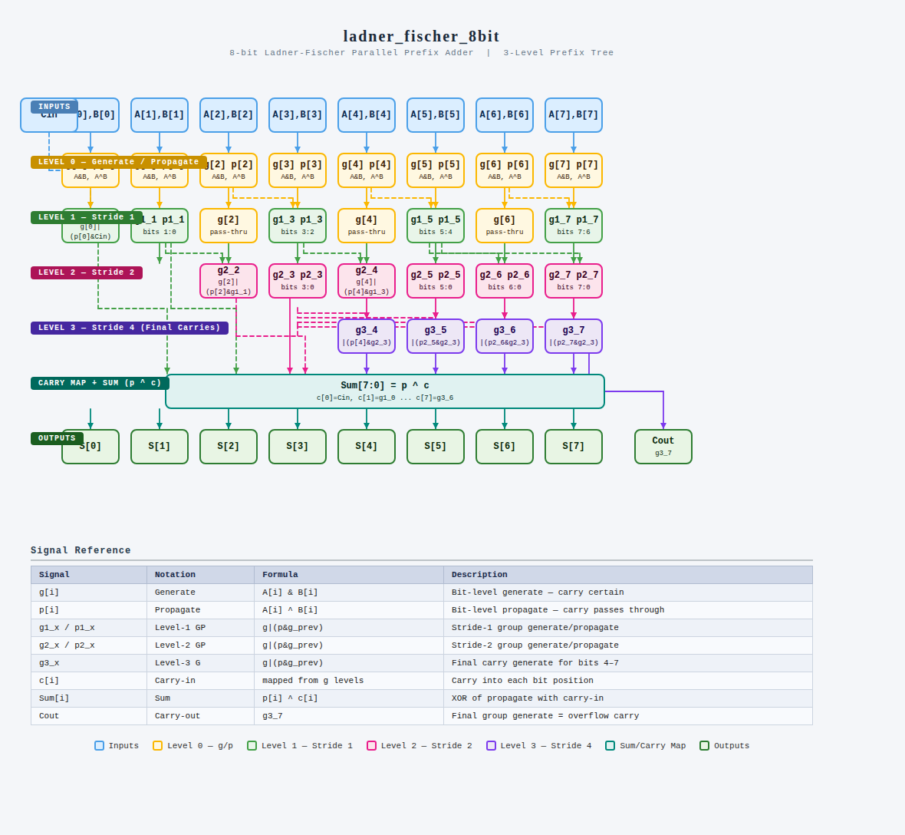

# 8-bit Ladner-Fischer Parallel Prefix Adder IP

## 1. Description
This IP core implements a high-speed **8-bit Ladner-Fischer Parallel Prefix Adder** in structural Verilog HDL. 

Traditional adders, such as Ripple Carry Adders (RCA), suffer from linear propagation delays $O(N)$ because each bit stage must wait for the carry bit to generate from the previous stage. The Ladner-Fischer architecture overcomes this constraint by reformulating addition as a parallel prefix tree operation. By computing look-ahead carry networks concurrently across structured segments (strides), this tree design limits the critical path delay to just $\log_2 N$ logic-level stages. This structural acceleration delivers maximum performance in data execution paths, making it highly suitable for high-speed ALUs and floating-point math processors.

---

## 2. Parallel Prefix Tree Topology
The arithmetic look-ahead tree cells and parallel group logic paths map exactly to the reference engineering hardware map below:

### Parallel Prefix Processing Stages:
1. **Level 0 (Generate / Propagate Primitive):** Computes the base bit-level generate ($g_i = A_i \cdot B_i$) and propagate ($p_i = A_i \oplus B_i$) vectors simultaneously across all 8 bit channels.
2. **Level 1 (Stride 1):** Groups adjacent bit lines to compute pairs of local group prefixes ($g1_x, p1_x$) for odd-indexed lines, while checking the system `Cin` baseline directly at bit 0.
3. **Level 2 (Stride 2):** Widens the processing scope to cross-couple stride-1 outputs, computing group metrics ($g2_x, p2_x$) across larger blocks. Even channels like bit 2 and bit 4 integrate preceding group data here.
4. **Level 3 (Stride 4 - Final Carries):** Resolves the highest-order prefix block allocations. By routing data from the lower 4-bit block boundary directly to bits 4 through 7, the tree finishes processing all intermediate internal carry signals ($c_5$ to $c_7$) concurrently.

---

## 3. Pin Description

| Pin Name | Direction | Data Type | Width  | Description |
|:---------|:----------|:----------|:-------|:------------|
| `A`      | Input     | Wire      | 8 bits | Multi-bit Augend operand array |
| `B`      | Input     | Wire      | 8 bits | Multi-bit Addend operand array |
| `Cin`    | Input     | Wire      | 1 bit  | Initial carry-in input signal |
| `Sum`    | Output    | Wire      | 8 bits | Resolved 8-bit arithmetic sum result output vector |
| `Cout`   | Output    | Wire      | 1 bit  | Final overflow group carry-out bit ($c_8$) |

---

## 4. Signal Reference Manifest

The following tracking signals manage the prefix grouping operations through the hierarchical network:

| Internal Notation | Analytical Formula | Hardware Description Profile |
|:------------------|:-------------------|:-----------------------------|
| `g[i]`            | $A_i \cdot B_i$    | Bit-level generate — indicates a carry will certainly form |
| `p[i]`            | $A_i \oplus B_i$   | Bit-level propagate — indicates a carry passes through |
| `g1_x` / `p1_x`   | Prefix Equation    | Stride-1 group generate and propagate data paths |
| `g2_x` / `p2_x`   | Prefix Equation    | Stride-2 group generate and propagate data paths |
| `g3_x`            | Prefix Equation    | Level-3 Stride-4 final carry generation lines |
| `c[i]`            | Map Distribution   | Dynamic array feeding resolved carries directly to bit blocks |
| `Sum[i]`          | $p_i \oplus c_i$   | Final bit summation matching bit propagate to active carry |

---

