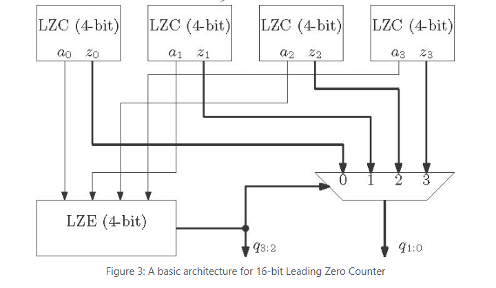

# 16-bit Hierarchical Leading Zero Counter (LZC) IP

## 1. Description
This IP core implements a high-performance **16-bit Leading Zero Counter (LZC)** designed hierarchically in Verilog HDL. A Leading Zero Counter is a critical component in arithmetic units, particularly in floating-point units (FPUs) for normalization, as well as in priority encoders and logarithmic processors. 

Instead of a slow, linear priority chain, this design uses an optimized **tree-structured architecture**. It breaks down the 16-bit input into four 4-bit sub-groups (nibbles), processes them concurrently using 4-bit LZC primitives, and resolves the final 4-bit count using a centralized **Leading Zero Encoder (LZE)** and a multiplexed selection path. This approach significantly reduces combinational propagation delay ($T_{pd}$).

---

## 2. Architectural Block Diagram
The internal hardware organization maps exactly to the hierarchical block diagram below, illustrating concurrent sub-group counting and multiplexer-based bit selection:

### Design Breakdown & Algorithm Flow:
1. **Parallel Nibble Processing:** The 16-bit input vector is segmented into four 4-bit groups. Each group is routed to an independent `lzc4` block that simultaneously computes local zero flags (`a0`–`a3`) and internal zero counts (`z0`–`z3`).
2. **Coarse Encoding (Most Significant Bits):** The 4-bit Leading Zero Encoder (LZE) acts as a priority arbiter over the zero flags. It determines which nibble contains the first valid non-zero bit from left to right, generating the two MSBs of the output (`q3:2`).
3. **Fine Selection (Least Significant Bits):** The coarse index `q3:2` acts as the select line for a 4:1 multiplexer. This MUX routes the appropriate local 2-bit count (`z0`–`z3`) to form the final two LSBs (`q1:0`).

---

## 3. Pin Description

| Pin Name    | Direction | Data Type | Width   | Description |
|:------------|:----------|:----------|:--------|:------------|
| `in`        | Input     | Wire      | 16 bits | 16-bit input data stream to be evaluated |
| `out`       | Output    | Wire/Reg  | 4 bits  | Final binary count representing total leading zeros ($0$ to $15$) |
| `all_zeros` | Output    | Wire      | 1 bit   | Active-high global flag asserting when the entire 16-bit input vector is zero |

---

## 4. Functional Truth Tables

### Module: `lzc4` (4-bit Sub-Block Primitive)
Each sub-block monitors a 4-bit slice `x[3:0]` and outputs a local count `z[1:0]` and an all-zero marker `a`:

| Input `x[3:0]` (Binary) | Valid Zero Flag `a` | Local Count `z[1:0]` | Functional Interpretation |
|:------------------------|:-------------------:|:--------------------:|:--------------------------|
| `1???`                  | `0`                 | `2'b00`              | 0 Leading Zeros           |
| `01??`                  | `0`                 | `2'b01`              | 1 Leading Zero            |
| `001?`                  | `0`                 | `2'b10`              | 2 Leading Zeros           |
| `0001`                  | `0`                 | `2'b11`              | 3 Leading Zeros           |
| `0000`                  | `1`                 | `2'bxx`              | All bits zero inside block|

### Module: Top-Level `LZE` Priority Mapping
The leading zero encoder tracks the `a` outputs from the sub-blocks to assign the primary vector position index `q32`:

| Vector Status `{a0, a1, a2, a3}` | Coarse Out `q32` | Selected Lower Bits `q10` | Total Array Zero Meaning |
|:---------------------------------|:----------------:|:-------------------------:|:-------------------------|
| `4'b0???`                        | `2'b00`          | `z0`                      | First '1' found in Block 0 (`in[15:12]`) |
| `4'b10??`                        | `2'b01`          | `z1`                      | First '1' found in Block 1 (`in[11:8]`)  |
| `4'b110?`                        | `2'b10`          | `z2`                      | First '1' found in Block 2 (`in[7:4]`)   |
| `4'b1110`                        | `2'b11`          | `z3`                      | First '1' found in Block 3 (`in[3:0]`)   |
| `4'b1111`                        | `2'b11`          | `z3` (`2'bxx`)            | Complete 16-bit input array is zero     |

---

