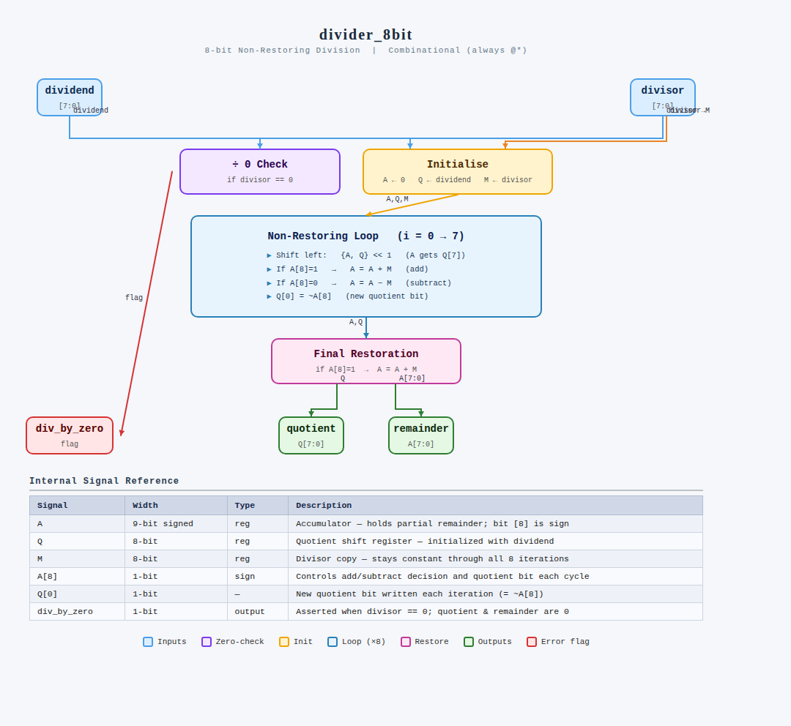

# 8-bit Combinational Non-Restoring Divider IP

## 1. Description
This IP core implements a high-performance, fully combinational **8-bit Divider** using the **Non-Restoring Division Algorithm** in Verilog HDL. 

Unlike restoring division architectures that conditionally restore the partial remainder after a negative subtraction subtraction step (wasting area and execution latency), the non-restoring algorithm processes a continuous sequence of shifts and conditional additions/subtractions. The design implements a dense hardware matrix that completes an entire 8-bit array division operation within a single clock cycle, making it ideal for integration into high-frequency execution pipelines.

---

## 2. Architectural Execution Datapath
The algorithmic implementation and flow breakdown map exactly to the reference engineering architecture below:

### Algorithmic Hardware Breakdown:
1. **Zero-Check Safety Guard:** Evaluates the `divisor` immediately. If it is equal to zero, an error line `div_by_zero` is asserted high while the mathematical array is kept safely clear.
2. **Initialization State:** Prepares internal wide structures: Accumulator (`A`) is cleared, Quotient shift register (`Q`) is loaded with the `dividend`, and Multiplicand (`M`) receives the `divisor`.
3. **The Non-Restoring Matrix Loop ($i = 0 \rightarrow 7$):**
   * **Shift Phase:** Combined array `{A, Q}` is shifted left by 1 bit, moving the MSB bit of `Q` into the LSB tracking boundary of `A`.
   * **Arithmetic Step:** The sign-bit of the Accumulator (`A[8]`) determines the next decision. If `A` is negative (`A[8] == 1`), the design executes `A = A + M`. If `A` is positive (`A[8] == 0`), it executes `A = A - M`.
   * **Quotient Placement:** The new sign of `A` dictates the computed quotient update. If `A` is negative, `Q[0] = 0`. If `A` is positive, `Q[0] = 1`.
4. **Final Structural Restoration:** At the conclusion of all 8 cycles, if the final value inside Accumulator `A` is negative, a restoration step executes `A = A + M` to correct the final remainder representation.

---

## 3. Pin Description

| Pin Name      | Direction | Data Type | Width  | Description |
|:--------------|:----------|:----------|:-------|:------------|
| `dividend`    | Input     | Wire      | 8 bits | Unsigned 8-bit Numerator input array |
| `divisor`     | Input     | Wire      | 8 bits | Unsigned 8-bit Denominator input array |
| `quotient`    | Output    | Reg       | 8 bits | 8-bit generated output vector tracking division result |
| `remainder`   | Output    | Reg       | 8 bits | 8-bit resolved modulo remainder output array |
| `div_by_zero` | Output    | Reg       | 1 bit  | Active-high error flag asserted when incoming divisor is zero |

---

## 4. Signal Reference Manifest

The following core variables manage the tracking paths inside the unrolled execution block:

| Internal Signal Name | Register Tracking Width | Signed Flag Status | Hardware Assignment Profile |
|:---------------------|:------------------------|:------------------:|:----------------------------|
| `A`                  | 9 bits                  | **Signed** | Accumulator — Tracks partial remainder. Bit `A[8]` indicates current sign profile. |
| `Q`                  | 8 bits                  | Unsigned           | Quotient register — Shifted left; dynamically populated from bit position `Q[0]`. |
| `M`                  | 8 bits                  | Unsigned           | Constant Divisor mirror store — Static across all unrolled operations. |

---

