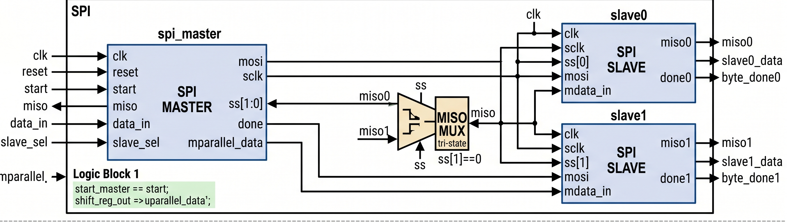
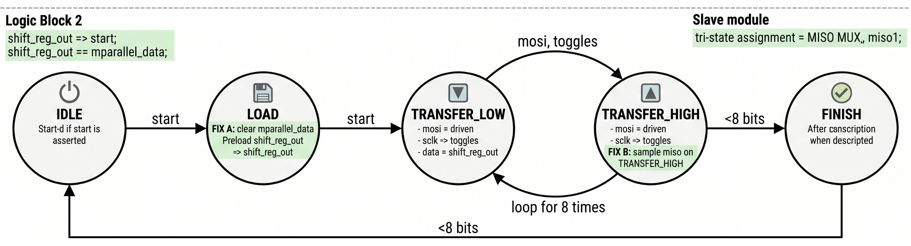

# SPI Controller IP with Master & Multi-Slave Architecture

## 1. Description
This IP core implements a fully synchronous **Serial Peripheral Interface (SPI) Controller** designed in Verilog HDL. The subsystem encapsulates a single advanced SPI Master module linked to two independent SPI Slave modules via a shared serial bus. 

To achieve maximum noise immunity and clean synchronization across standard field-programmable gate array (FPGA) logic fabrics, all modules run on a high-frequency system clock (`clk`). Edge transitions on the serial clock (`sclk`) are evaluated through synchronized delay registers. The master controller utilizes an optimized Finite State Machine (FSM) to manage a multi-slave select layout, parallel-to-serial data shifting (via `mosi`), and serial-to-parallel bit capturing (via `miso`). 

---

## 2. System Block Diagram
The internal hardware layout maps exactly to the multi-module interconnect diagram below:

### Architectural Interconnect Subsystems:
1. **SPI Master (`spi_master`):** Governs system operations, drives the master-out-slave-in (`mosi`) serial line, toggles the serial clock (`sclk`), and decodes the active-low slave select array (`ss[1:0]`) based on the targeted peripheral address.
2. **SPI Slaves (`slave0` / `slave1`):** Synchronous peripheral blocks that monitor the shared `mosi` and `sclk` lines. They capture serial streams when their distinct slave select line is pulled low and return data through independent tri-state lines (`miso0`, `miso1`).
3. **MISO Tri-State Multiplexer:** Implements an internal hardware multiplexing structure. When a slave module is deselected, its `miso` pin enters a high-impedance state (`1'bz`), preventing line contention and allowing the active slave to drive the system-wide master-in-slave-out line cleanly.

---

## 3. Finite State Machine (FSM) State Chart
The operational timing and bit-shifting loops are managed by an advanced 5-state synchronous FSM inside the master controller:

### FSM State Descriptions:
* **`IDLE` (3'd0):** The controller remains clear, pulling `done` low and maintaining `sclk` at a stable low baseline. Upon receiving an active-high `start` strobe, it routes immediately to `LOAD`.
* **`LOAD` (3'd1):** Preloads the outgoing 8-bit parallel data (`data_in`) into the local master shift register (`shift_reg_out`). It resets the internal serial bit counter (`bit_cnt`), samples the address configuration input (`slave_sel`) to assert the correct active-low slave line (`ss`), and moves to `TRANSFER_LOW`.
* **`TRANSFER_LOW` (3'd2):** Drives the serial clock `sclk` low. The master extracts the current bit from the shift register workspace based on the value of `bit_cnt` and places it onto the `mosi` pin. It then jumps to `TRANSFER_HIGH`.
* **`TRANSFER_HIGH` (3'd3):** Drives `sclk` high. The active peripheral samples the `mosi` data line on this rising edge. Simultaneously, the master samples the current input on the `miso` line, shifting it into its parallel capture register (`mparallel_data`). If the internal counter hits `3'd7`, it advances to `FINISH`; otherwise, it increments `bit_cnt` and loops back to `TRANSFER_LOW`.
* **`FINISH` (3'd4):** Returns `sclk` low, releases the slave select lines back to an idle high state (`2'b11`), asserts the operational completion flag `done` high for one cycle, and moves back to `IDLE`.

---

## 4. Pin Description

| Pin Name         | Direction | Data Type | Width  | Description |
|:-----------------|:----------|:----------|:-------|:------------|
| `clk`            | Input     | Wire      | 1 bit  | Global System Master Clock |
| `reset`          | Input     | Wire      | 1 bit  | Global Asynchronous High Reset line |
| `start`          | Input     | Wire      | 1 bit  | Master trigger to initiate an 8-bit byte transfer |
| `data_in`        | Input     | Wire      | 8 bits | Parallel data byte to be transmitted out from the master |
| `mdata_in`       | Input     | Wire      | 8 bits | Parallel data byte preloaded into slaves for transfer back to master |
| `slave_sel`      | Input     | Wire      | 1 bit  | Slave addressing vector (`0` targets Slave 0, `1` targets Slave 1) |
| `slave0_data`    | Output    | Wire      | 8 bits | 8-bit parallel register output capturing incoming data inside Slave 0 |
| `slave1_data`    | Output    | Wire      | 8 bits | 8-bit parallel register output capturing incoming data inside Slave 1 |
| `done`           | Output    | Wire      | 1 bit  | Global transfer status flag indicating a completed 8-bit cycle |
| `mparallel_data` | Output    | Wire      | 8 bits | Parallel data register storing bytes read into the master from a slave |

---

