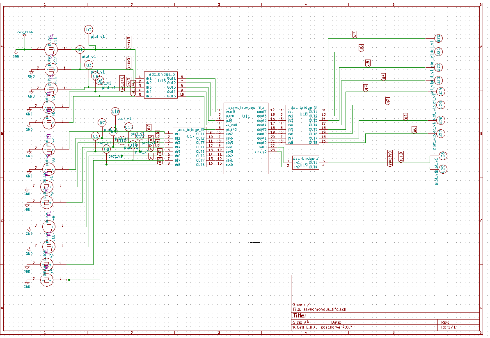

# Asynchronous FIFO

## Description
This IP implements an Asynchronous FIFO in Verilog, designed to safely transfer data between two different clock domains.

## Block Diagram

## Contact Details
- **Author**: Srinu Badam
- **GitHub**: [srinubadam09](https://github.com/srinubadam09)
