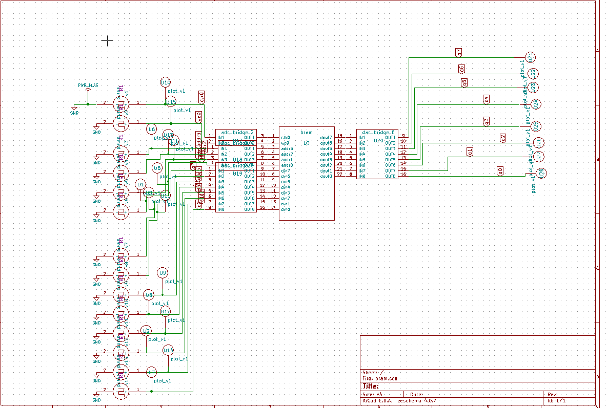

# Block RAM (BRAM)

## Description
This IP implements a Block RAM (BRAM) module in Verilog, typically used for on-chip memory storage.

## Block Diagram

## Contact Details
- **Author**: Srinu Badam
- **GitHub**: [srinubadam09](https://github.com/srinubadam09)
