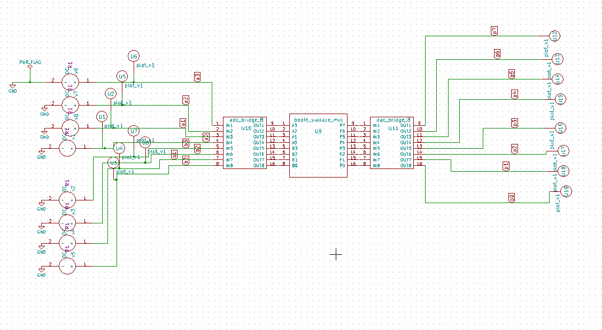

# Booth Wallace Multiplier

## Description
This IP implements a Booth Wallace Multiplier in Verilog, designed for fast and efficient binary multiplication.

## Block Diagram

## Contact Details
- **Author**: Srinu Badam
- **GitHub**: [srinubadam09](https://github.com/srinubadam09)
