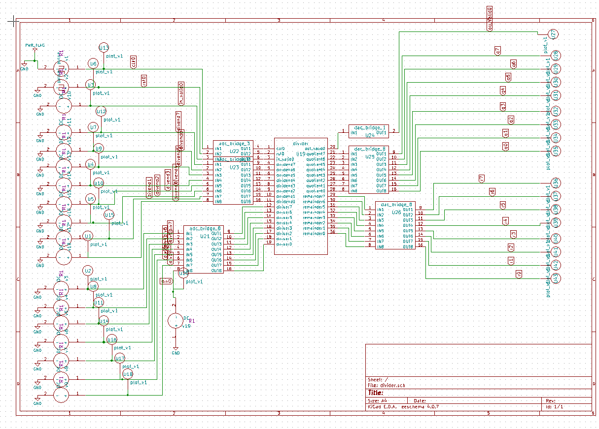

# Divider

## Description
This IP implements a digital Divider in Verilog for arithmetic operations.

## Block Diagram

## Contact Details
- **Author**: Srinu Badam
- **GitHub**: [srinubadam09](https://github.com/srinubadam09)
