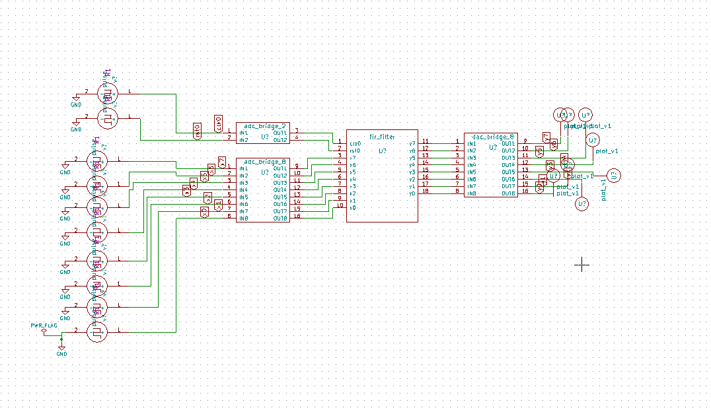

# FIR Filter

## Description
This IP implements a Finite Impulse Response (FIR) Filter in Verilog, typically used for digital signal processing.

## Block Diagram

## Contact Details
- **Author**: Srinu Badam
- **GitHub**: [srinubadam09](https://github.com/srinubadam09)
