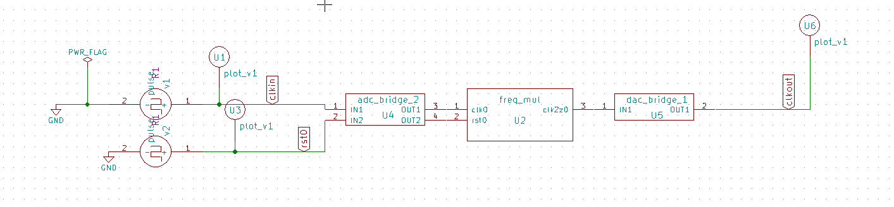

# Frequency Multiplier

## Description
This IP implements a Frequency Multiplier in Verilog to multiply the input clock frequency.

## Block Diagram

## Contact Details
- **Author**: Srinu Badam
- **GitHub**: [srinubadam09](https://github.com/srinubadam09)
