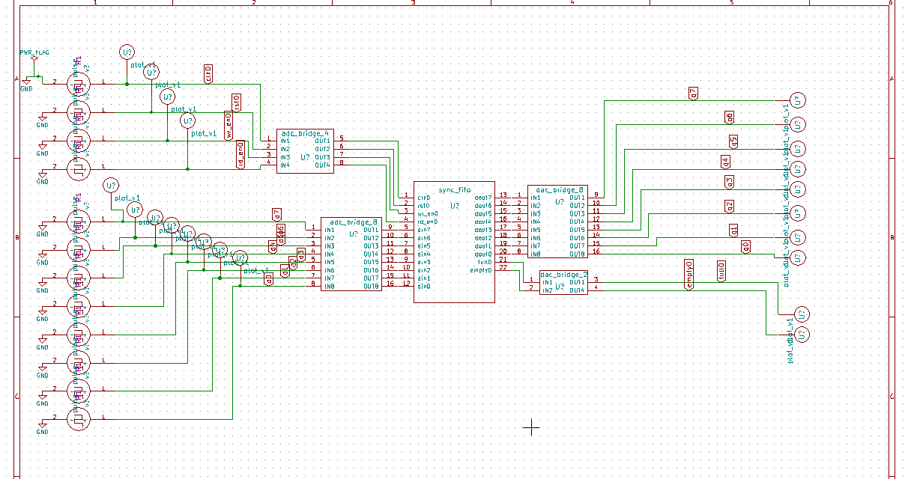

# Synchronous FIFO

## Description
This IP implements a Synchronous FIFO in Verilog, designed for data buffering and transfer within a single clock domain.

## Block Diagram

## Contact Details
- **Author**: Srinu Badam
- **GitHub**: [srinubadam09](https://github.com/srinubadam09)
