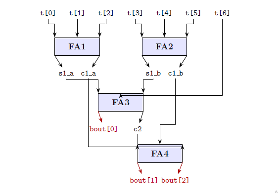

# 7:3 Thermometer-to-Binary Wallace Tree Encoder IP

## 1. Description
This IP core implements a high-speed **7:3 Thermometer-to-Binary Encoder** using a structured **Wallace Tree Reduction Network** in structural Verilog HDL. 

In high-speed Flash Analog-to-Digital Converters (ADCs), the output of the parallel comparator array is a thermometer code (a continuous block of 1s followed by 0s). Converting this directly to binary using traditional priority encoders makes the circuit highly vulnerable to "sparkle codes" or "bubble errors"—where noise causes a temporary 0 to appear inside the block of 1s. 

This Wallace Tree design solves that issue completely. Instead of checking vector positions, it treats the 7 thermometer bits as individual weights of $2^0$ and utilizes a parallel reduction tree composed of Full Adders (FA) to compute the exact population count (the total number of logic-high bits). This approach provides robust bubble-error correction natively while maintaining a highly parallelized datapath with minimum combinational latency.

---

## 2. Architectural Reduction Tree Diagram
The internal bit-level reduction maps exactly to the tracking paths illustrated in the hardware block diagram below:

### Reduction Architecture & Weighted Stages:
* **Stage 1 (Bit-Level Parallel Compression):** The primary 7-bit thermometer vector `thermo_in[6:0]` is divided. `FA1` processes bits `[0:2]` while `FA2` processes bits `[3:5]`. They compress 6 input bits down to 2 local sum bits (weight $2^0$) and 2 local carry bits (weight $2^1$).
* **Stage 2 (LSB Generation):** `FA3` combines the local sums (`s1_a`, `s1_b`) with the final remaining input bit `thermo_in[6]`. The resulting sum bit forms the true Least Significant Bit of the digital system: **`binary_out[0]`**. Its carry output (`c2`) carries a weight of $2^1$.
* **Stage 3 (MSB Vector Array Resolution):** `FA4` operates entirely on the weight $2^1$ carry lines. It compresses the three intermediate carry signals (`c1_a`, `c1_b`, and `c2`). The final sum bit produces **`binary_out[1]`** (weight $2^1$), and the final output carry directly produces **`binary_out[2]`** (weight $2^2$).

---

## 3. Pin Description

| Pin Name      | Direction | Data Type | Width  | Description |
|:--------------|:----------|:----------|:-------|:------------|
| `thermo_in`   | Input     | Wire      | 7 bits | 7-bit Thermometer code input vector (from Flash ADC comparators) |
| `binary_out`  | Output    | Wire      | 3 bits | 3-bit binary coded digital output result ($000$ to $111$) |

---

## 4. Operational Mapping Table

The table below shows how the population count architecture perfectly linearizes the thermometer inputs into a standard binary representation:

| Thermometer Input `thermo_in[6:0]` (Binary) | Active-High Bit Count | Coded Binary Output `binary_out[2:0]` | Equivalent Decimal Value |
|:-------------------------------------------|:---------------------:|:-------------------------------------:|:------------------------:|
| `0000000`                                  | 0                     | `000`                                 | 0                        |
| `0000001`                                  | 1                     | `001`                                 | 1                        |
| `0000011`                                  | 2                     | `010`                                 | 2                        |
| `0000111`                                  | 3                     | `011`                                 | 3                        |
| `0001111`                                  | 4                     | `100`                                 | 4                        |
| `0011111`                                  | 5                     | `101`                                 | 5                        |
| `0111111`                                  | 6                     | `110`                                 | 6                        |
| `1111111`                                  | 7                     | `111`                                 | 7                        |
| *Any configuration with Bubble Noise* | *Exact Sum of 1s* | *Corrected Binary Vector* | *True PopCount* |

---

